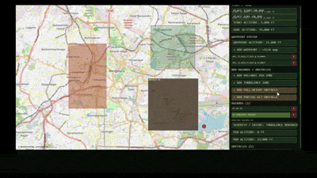
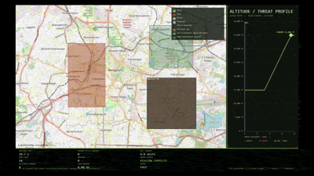

<pre>
+------------------------------------------------------------------------+
|                                                                        |
|          █████   █████████   ██████   █████ █████  █████  █████████    |
|         ░░███   ███░░░░░███ ░░██████ ░░███ ░░███  ░░███  ███░░░░░███   |
|          ░███  ░███    ░███  ░███░███ ░███  ░███   ░███ ░███    ░░░    |
|          ░███  ░███████████  ░███░░███░███  ░███   ░███ ░░█████████    |
|          ░███  ░███░░░░░███  ░███ ░░██████  ░███   ░███  ░░░░░░░░███   |
|    ███   ░███  ░███    ░███  ░███  ░░█████  ░███   ░███  ███    ░███   |
|   ░░████████   █████   █████ █████  ░░█████ ░░████████  ░░█████████    |
|    ░░░░░░░░   ░░░░░   ░░░░░ ░░░░░    ░░░░░   ░░░░░░░░    ░░░░░░░░░     |
|                                                                        |
+------------------------------------------------------------------------+
|                    An Adaptive Flight-Path planner                     |
+------------------------------------------------------------------------+
</pre>

A **<ins>Pygame-based educational simulation</ins>** that demonstrates **<ins>live hazard detection</ins>** and **<ins>on-the-fly trajectory replanning</ins>** for a drone. The aircraft begins on a simple **nominal route**. A **<ins>forward-looking sensor</ins>** continuously scans ahead; when **volcanic ash**, **moderate/high turbulence**, or **solid obstacles** enter the sensor footprint, the system invokes **<ins>A\*</ins>** and locks a new **safe trajectory**.

---

💠 **<ins>Key Capabilities :</ins>**
<table> <tr> <td valign="top" width="50%">

🢥 <ins>Two environments</ins>

Grid Mode – Discrete <code>3-D grid</code> (columns × rows × altitude layers) for clear visualisation of the algorithm.
Real-World Map Mode – <b>OpenStreetMap</b> tiles (<code>Bengaluru area</code> by default) with geographic start/goal/waypoints and <b>synthetic hazard zones</b>.
 ⠀
</td> <td valign="top" width="50%">

🢥 <ins>Live sensing & adaptive replanning</ins>

Sensor range: <code>6 cells</code>
A* is called <ins>only after a threat is detected</ins>.
</td> </tr> <tr> <td valign="top" width="50%">

🢥 <ins>Avoidance rules</ins>

The system prioritizes threats based on the <b>severity of degradation</b> the system would face inside them. For example:

・Volcanic ash and high turbulence are <ins>hard exclusion volumes</ins>.
 ・Low turbulence is a <ins>soft pass-through region</ins>.
 ・TFRs are treated as <ins>solid barriers</ins> based on the altitude restrictions placed by regulators.
 ⠀
</td> <td valign="top" width="50%">

🢥 <ins>3-D flight model</ins>

<code>9 altitude layers</code> (0 – 40,000 ft in 5,000 ft steps).
Ascent maneuvers carry higher cost, as the system is optimized to keep the same rate of fuel consumption unless for <ins>life-saving maneuvers</ins>.
A wind penalty is applied when flying against the prevailing wind.
</td> </tr> </table>

---

✅ **<ins>Requirements :</ins>**
 ⠀
 ⠀⠀⠀・ Python 3.8
 ⠀⠀⠀・ Pygame 2.6.1
 ⠀⠀⠀・ Requests 2.32.0
 ⠀⠀⠀・ Pillow 10.0.0

> [!Note]
> To use Map Mode install pillow using bash and have an internet connection while using it since it pulls OpenStreetMap API

---

🏎️💨 **<ins>Quick Start Guide :</ins>**

<table> <tr> <td align="center" valign="top" width="50%"> 🢥 Use the right-hand panel to: Place Start / Goal (or cycle their altitudes). Add waypoints at a chosen altitude.  ⠀ &nbsp; </td> <td align="center" valign="top" width="50%">  &nbsp; </td> </tr> <tr> <td align="center" valign="top" width="50%"> 🢥 Draw ash / turbulence / obstacle zones (click “Add …”, then two corners on the grid). Optionally press RANDOMIZE SCENARIO.  ⠀ &nbsp; </td> <td align="center" valign="top" width="50%">  &nbsp; </td> </tr> <tr> <td align="center" valign="top" width="50%"> 🢥 Click LAUNCH LIVE-REPLAN MISSION. Watch the drone fly the nominal path. When a threat enters the sensor circle the system announces detection, pauses briefly, then locks a corrected trajectory (old path shown dashed).  ⠀  &nbsp; </td> <td align="center" valign="top" width="50%">  &nbsp; </td> </tr> <tr> <td align="center" valign="top" width="50%"> 🢥 Press P for the performance report, R to reset the flight while keeping the scenario, or use the panel buttons.  ⠀ &nbsp; </td> <td align="center" valign="top" width="50%">  &nbsp; </td> </tr> </table>

> [!IMPORTANT]
> **Map Mode :**
> Click REFRESH MAP TILES (or let it load automatically). Place Start / Goal / waypoints by clicking the map. Draw geographic hazard/obstacle rectangles the same way. Use mouse-wheel over the map to zoom, drag to pan, wheel over the panel to scroll. Launch the mission. Behaviour is identical to Grid Mode; the altitude profile and dashboard remain fully functional.

---

